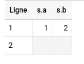
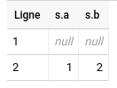

# Minimal example to demonstrate bug with ORC batch-upload to BigQuery
 
## Requirements
 
### Have spark-2.3.2 installed locally and `$SPARK_HOME` correctly set

### Have maven-3.6.0 or later installed 

### Have the necessary jars to upload files on Google Storage
(Skip this if your local spark installation can already upload files
on Google Storage).

They can be downloaded by running the following command

```
mvn dependency:copy-dependencies
```

and copying the content of `target/dependency/` into `$SPARK_HOME/jars`
 
You also need to remove `$SPARK_HOME/jars/guava-14.0.1.jar` 
because a more recent version is downloaded.


## Setup 

### Setup python virtual environment 
```
python3 -m virtualenv -p python3 venv
source venv/bin/activate && python3 -m pip install $QUIET -r requirements.txt
```
 
### Configure

* Add a `conf/gcs-credentials.json` files with the proper credentials to your testing environment
* Rename `conf.py.template` to `conf.py` and fill the missing variables

## Run

```
python main.py 
```

## Check out the result

Go to your BigQuery console and look at the newly created table:


### What should happen

The second row DataFrame created by Spark has a null struct
```
>>> df.show()
+------+
|     s|
+------+
|[1, 2]|
|  null|
+------+
```
We should get the same thing on BigQuery



### What happens instead

We get a non-null struct with null fields




## Data sample

The ORC file written by spark with my setup are present 
in the `data/orc_test` folder. 
This should help finding any platform-specific issues.

